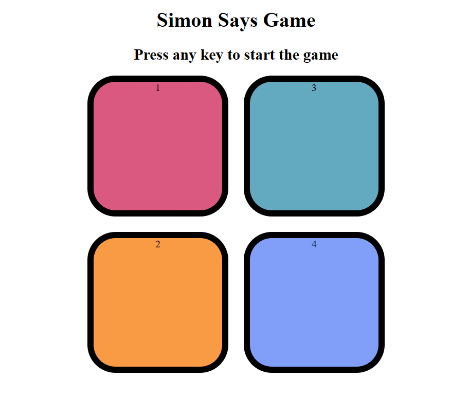

# Classic Simon Game

Welcome to the repository of the Classic Simon Game, a delightful and engaging interactive experience that tests your memory and reflexes. This project brings the nostalgic Simon game into the digital era, combining vibrant visuals with progressively challenging gameplay. Dive into a world of colours and sounds, where each level pushes your cognitive abilities to new heights!



## Features

- **Engaging Interactive Gameplay:** Immerse yourself in a game that's easy to understand but challenging to master. Follow the pattern of lights and sounds and repeat them correctly to progress.
- **Vibrant Button Interface:** Each colour in the game is not just a visual treat but a crucial part of the gameplay. The buttons are designed to be visually appealing and responsive.
- **Progressively Challenging Difficulty:** As you advance, the game becomes more challenging, testing your memory and speed. Each stage is designed to offer a more significant challenge than the last.
- **Responsive Design:** Enjoy the game on any device! Our responsive design ensures a seamless experience whether you're playing on a desktop, tablet, or mobile phone.
- **Sound Effects and Visual Cues:** The game comes alive with intuitive sound effects and visual cues, making it accessible and enjoyable for players of all ages.

## How to Play

1. **Start the Game:** Press any keyboard button and watch the flashing button sequence.
2. **Memorize the Pattern:** Pay attention to the order in which the buttons light up.
3. **Repeat the Sequence:** Now it's your turn! Click the buttons in the same order.
4. **Level Up** Each time you correctly repeat the sequence, the game will incrementally increase the pattern length.
5. **Challenge Yourself:** See how far you can go! The game gets progressively more complex with each level.

## Technologies Used

- **HTML:** Structuring the game's interface.
- **CSS:** Styling the game, ensuring it's visually appealing and engaging.
- **JavaScript:** Powering the game's logic, interactivity, and dynamic difficulty adjustments.

## Installation

No installation is required! Clone the repository and open `index.html` in your browser to start playing.

```bash
git clone https://github.com/Koushik890/Simon-Game.git
cd Simon-Game
open index.html
